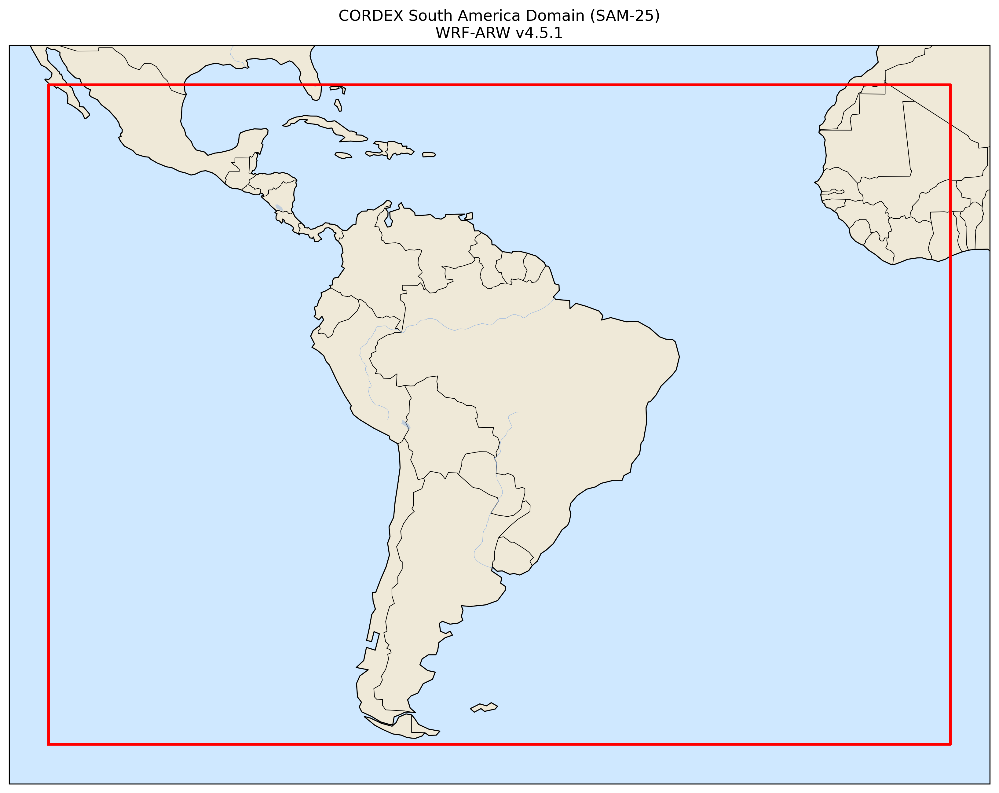

# CORDEX-CMIP6-SENAMHI

## CORDEX-CMIP6 South America Simulations using WRF-ARW v4.5.1

This repository contains the configuration files, domain definitions, namelists, physical parameterization settings, and supporting documentation used to perform CORDEX-CMIP6 regional climate simulations over South America with the Weather Research and Forecasting (WRF-ARW) model version 4.5.1.

The repository aims to support transparency, reproducibility, and long-term preservation of the modeling framework adopted by the National Meteorology and Hydrology Service of Peru (SENAMHI-PER) for the production of regional climate simulations. It provides the essential information required to reproduce the numerical experiments, including the WPS and WRF namelists, static domain definition files (geo_em), and the physical parameterization settings employed in the simulations.

This repository does not contain model outputs, initial and boundary condition files, or external datasets such as ERA5 reanalysis or CMIP6 Global Climate Model data. These datasets are distributed by their respective providers and must be obtained independently.

The configuration documented here was used to generate CORDEX-CMIP6 regional climate simulations over the South America CORDEX domain (SAM-25) at a horizontal resolution of 25 km.

Repository Contents
WPS configuration files (namelist.wps)
WRF configuration files (namelist.input)
Static domain definition files (geo_em)
Physical parameterization tables and documentation

This repository is intended for researchers and operational modeling centers interested in reproducing, evaluating, or extending CORDEX-CMIP6 regional climate simulations using WRF-ARW version 4.5.1.

## Physical Parameterizations

| Component | WRF Option | Scheme |
|-----------|:----------:|--------|
| Microphysics | `mp_physics = 28` | Thompson Aerosol-Aware |
| Longwave radiation | `ra_lw_physics = 4` | RRTMG |
| Shortwave radiation | `ra_sw_physics = 4` | RRTMG |
| Surface layer | `sf_sfclay_physics = 2` | Monin-Obukhov (Janjic Eta Similarity) |
| Land surface model | `sf_surface_physics = 2` | Noah Land Surface Model |
| Planetary Boundary Layer | `bl_pbl_physics = 2` | Mellor–Yamada–Janjic (MYJ) |
| Cumulus parameterization | `cu_physics = 6` | Tiedtke |
| Urban physics | `sf_urban_physics = 0` | None |
| Sea Surface Temperature | `sst_update = 1` | Daily SST update enabled |
| Greenhouse gases | `ghg_input = 1` | Time-varying greenhouse gas concentrations |
| Aerosol lateral boundary conditions | `use_aero_icbc = .true.` | Enabled |

## Domain configuration

